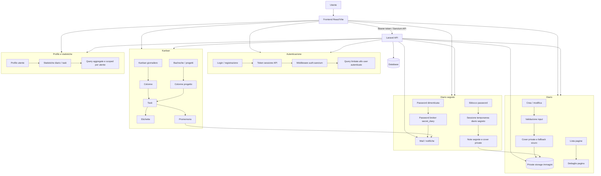

# My Diary - Process Map

Schema sintetico dei processi principali dell'app, utile per presentazione tecnica o colloquio.

## Flusso Frontend/Backend

- Il frontend chiama solo endpoint API Laravel.
- Gli endpoint privati passano da autenticazione Sanctum e lavorano sullo user autenticato.
- Le immagini diario e diario segreto sono servite tramite endpoint protetti, non come file pubblici diretti.
- Le Bacheche usano colonne e task scoped per utente/progetto; se una colonna viene eliminata, i task vengono spostati nella prima colonna disponibile della stessa board.
- I promemoria task sono preparati lato backend e inviati via mail/job, rispettando preferenze utente e timezone.
